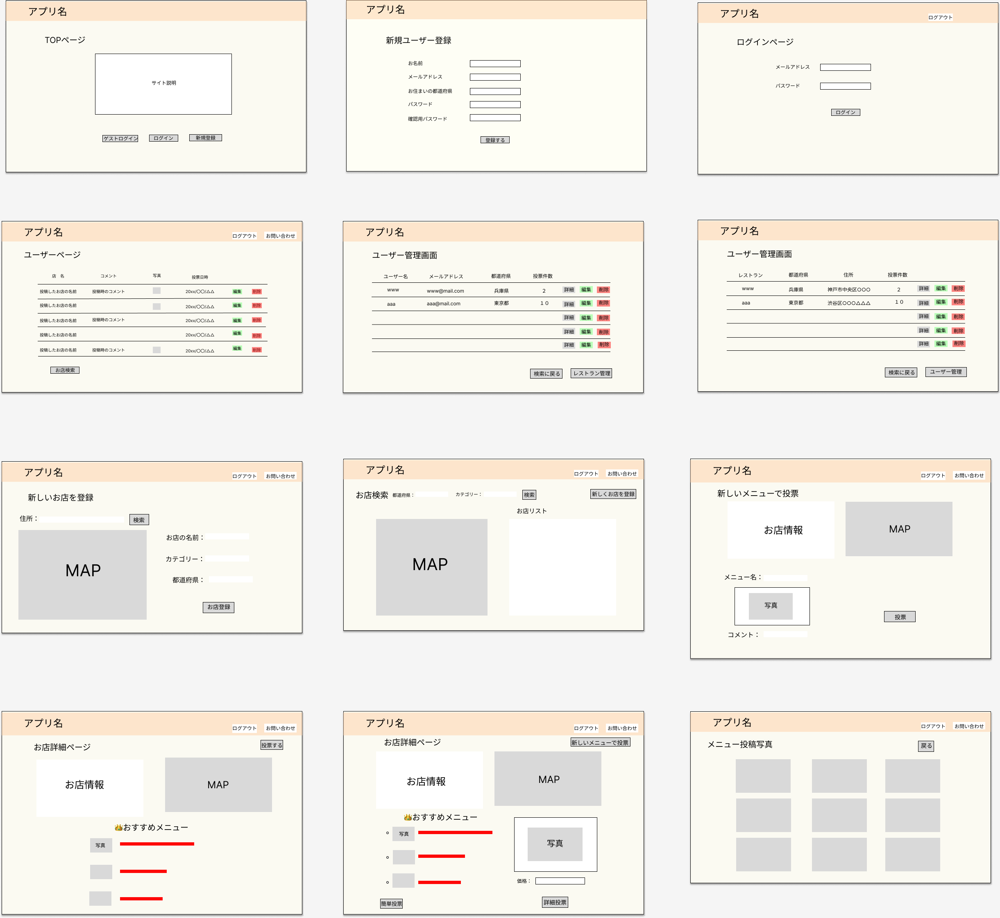
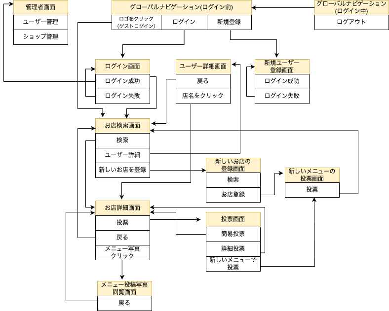

# README
## 開発言語

- ###### ruby：3.0.1 
- ###### rails：6.1.6 

### 就業Termの技術
- ###### device機能
- ###### AWS EC2

### カリキュラム外の技術

- ###### Google Map Embed API
- ###### Google Map Places

### 実行手順

##### _$ git clone git@github.com:yuko-fu/jimoguru.git_

####  _$ cd jimoguru_

#### _$ bundle install_

#### _$ rails db:create && rails db:migrate_  

#### _$ rails s_

### カタログ設計,テーブル定義書
##### https://docs.google.com/spreadsheets/d/16-EnuVIHFsquQogHSHujPEXfj4UD6U3k6iv8skIvTE8/edit#gid=2032360665

### ER図

### ワイヤーフレーム

### 画面遷移図

 